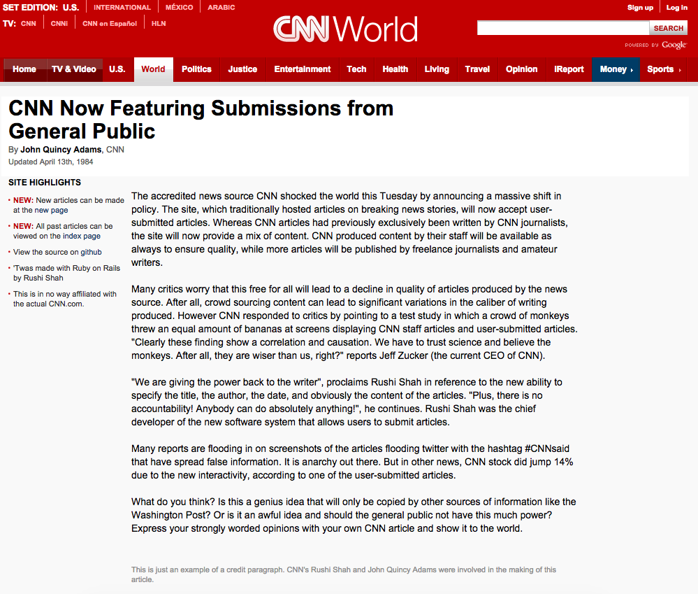

# UPDATE:

This is not fake news, I actually took the entire project down. This started as an innocent way to make a beloved high school activity more enjoyable. But fake news is now like a *thing*, and I didn't want to perpetuate that trend so I stopped hosting it. I don't see a real danger of deceiving people by leaving the source code up on Github so this page will survive. 

# [Create Your Own CNN Article](http://cnn.rshah.org/)

## How To
Want to create your own CNN article? Just head over to [the site](http://cnn.rshah.org/) and click new article. You can specify the title, author, date, and content. In the content text field line-breaks will be respected.

For more information see the [CNN article](http://cnn.rshah.org/articles/6) on the topic.  

## Why
This app originally came about to let the organizers of Model United Nations Conferences create press-releases on events (fictionally) transpiring in their committees to update the delegates. It was used extensively at TechMUN ([Thomas Jefferson High School for Science and Technology](http://www.newsweek.com/2014/09/19/number-1-high-school-america-offers-real-head-start-268693.html)'s MUN conference) in the Russian Cabinet Committee and the United Nations Security Council Committee.

Nowadays though it is just for anybody who wants to spoof a CNN article. Want to tweet an outrageous headline? Do it. Want to trick your friends? Go for it. Want to see your name in an international headline? Follow your dreams. 

## To Do
 - User Accounts
 - Make it more secure (there are massive security flaws right now)
 - ~~Images in articles~~
 - ~~Links in articles~~
 - ~~Editing articles after they are created~~
 - Allow more customization of articles like the credit paragraph and the sidebar content
 - Style the list of articles to look like they are on CNN as well
 - Input validation (no empty fields, etc.)

## Contributing
Think this project is awesome? Contribute to it! Think it is really awful? Contribute to it anyways to make it less awful! Either way, please contribute! If you see anything you want to help out with open up an issue. If you think your fix is simple enough not to warrant an issue just send in a pull request. As usual, follow good coding practice: please keep code neat, make sure it works, etc. 

## How it's made
This is a Ruby on Rails application (my first, in fact!) that was deployed using Heroku. 
