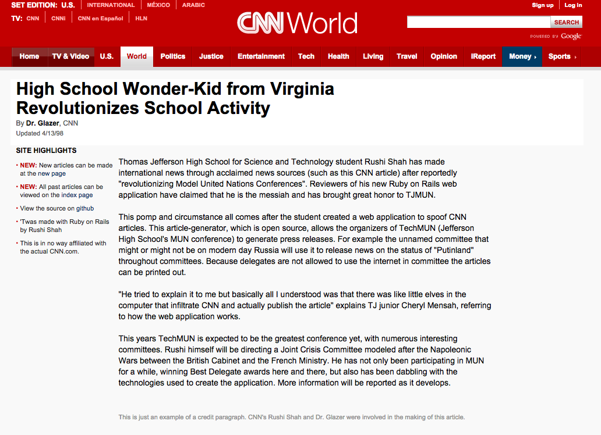

#[CNN CMS with CSS!](http://cnn.rshah.io/)
And also with Ruby on Rails, but who doesn't love acronyms that start with C?

##[Example](http://cnn.rshah.io/articles/2)
Please note the article is just a joke, I am not that pretentious in real life. 

##What?
This is an article-generator created as a content management system for Model United Nations Conference organizers to spoof CNN articles. It is definitely a niche product but creating fake news articles is very important in MUN committees for delegates to get press releases. It was used extensively at TechMUN ([Thomas Jefferson High School for Science and Technology](http://www.newsweek.com/2014/09/19/number-1-high-school-america-offers-real-head-start-268693.html)'s MUN conference) in the Russian Cabinet Committee and the United Nations Security Council Committee. 

##CNN?
Like the news source. 

##CMS?
Content management system: the users of the app (like the committee chairs or crisis staff) can manage the articles without having to touch anything tech-related. They just type their content into a form and this app will take care of the rest. 

##CSS?
Cascading style sheets: basically makes it look like CNN articles. Not really relevant to the title but (as I mentioned earlier) who doesn't love acronyms that start with C?

##How To
Need to create your own CNN article (for MUN or otherwise)? Just head over to [the site](http://cnn.rshah.io/) and click new article. You can specify the title, author, date, and content. In the content text field line-breaks will be respected.

For more information see the [CNN article](http://cnn.rshah.io/articles/6) on the topic.  

##To Do
 - User Accounts
 - Make it more secure (there are massive security flaws right now)
 - Images in articles
 - Links in articles (perhaps make it support markdown?)
 - Editing articles after they are created
 - Allow more customization of articles like the credit paragraph and the sidebar content
 - Style the list of articles to look like they are on CNN as well
 - Input validation (no empty fields, etc.)

##How it's made
This is a Ruby on Rails application (my first, in fact!) that was deployed using Heroku. 
